

<!-- PROJECT LOGO -->
 

  <a href="https://github.com/khshourov/plugin-pronounce-it">
    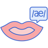
  </a>

<h3 align="center">Plugin - Pronounce it!</h3>

  

    Find the IPA, pronunciation, and meanings of a word directly within the Firefox browser
  

<!-- ABOUT THE PROJECT -->
## About The Project

With this simple plugin, you can search for the IPA, pronunciation, and meanings of a word. You can also double-click any word to display its lexical information. Additionally, it stores your search results in one place, allowing you to track words that give you trouble.

(<a href="#readme-top">back to top</a>)

### Built With

* [Browser extensions - Mozilla | MDN](Firefox-extensions-url)

(<a href="#readme-top">back to top</a>)

<!-- Installation -->
## Installation
Visit [releases](https://github.com/khshourov/plugin-pronounce-it/releases) and download the file with the .xpi extension from the latest release. Next, type `about:addons` in your Firefox URL bar and click the __*Tools for all add-ons*__ icon (next to the __*Manage Your Extensions*__ label). Then, select __*Install Add-on from File…*__ and choose the downloaded .xpi file. Firefox will prompt you to confirm the installation. Once confirmed, you’re all set. Enjoy the plugin!

<!-- USAGE EXAMPLES -->
## Usage
1.	Click the plugin toolbar icon.
   

2. Click the Google sign-in button.

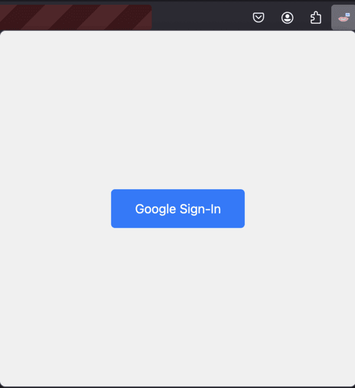

3. Enter your Google credentials (we will only access your Google ID, name, and email, and we will only store the Google ID to map data to your searches).

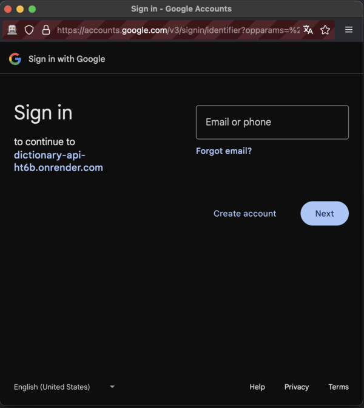

4. Click the plugin toolbar icon again and enter your search word.

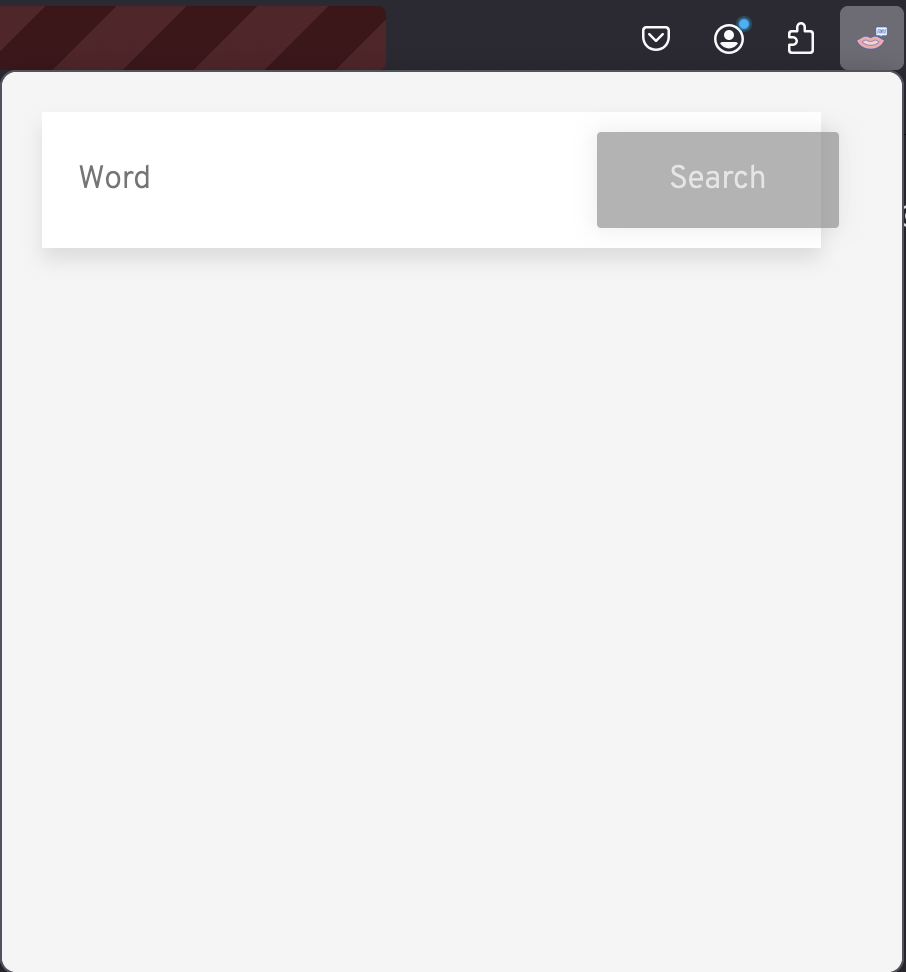

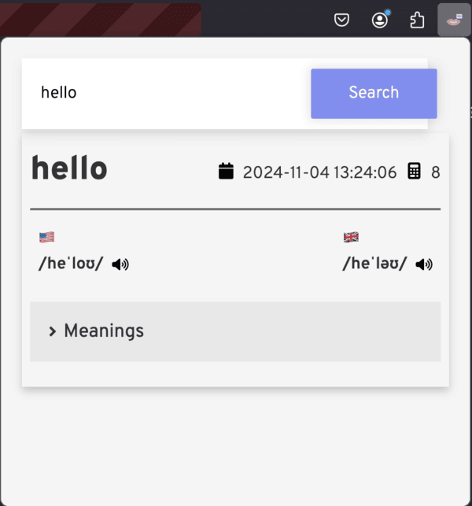

5. You can also double-click on a word to see the same result.

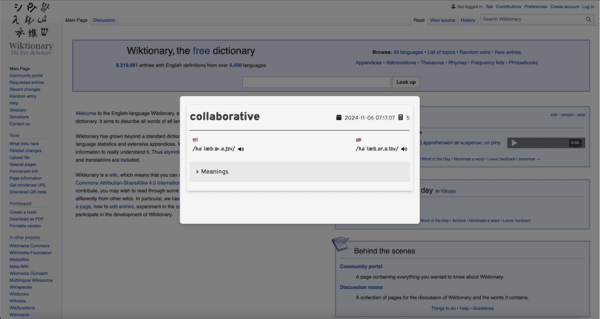

6. Alternatively, select a word, right-click, and choose the “Pronounce it!” option from the context menu.

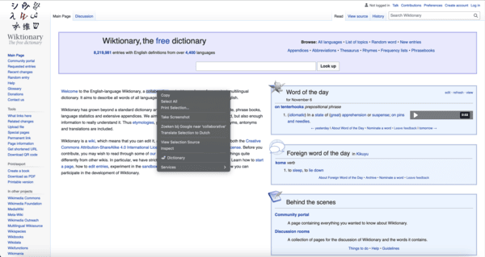

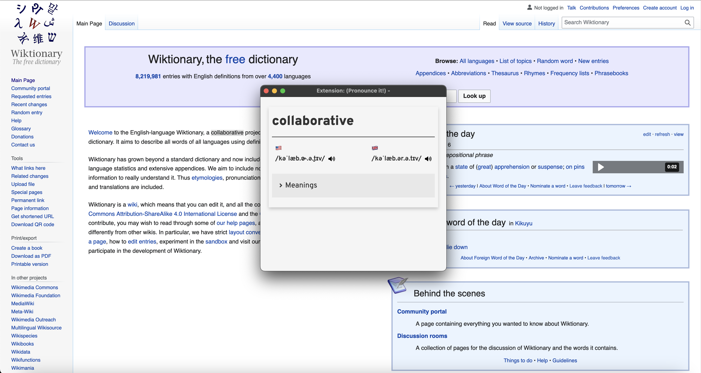

7. You can also disable the double-click action for the current page.

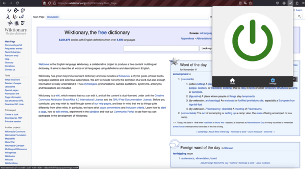

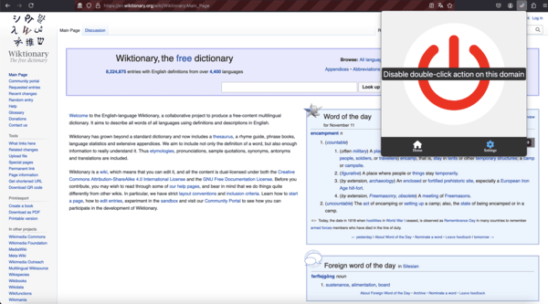

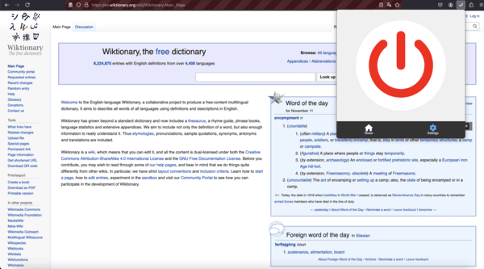

(<a href="#readme-top">back to top</a>)

<!-- ROADMAP -->
## Roadmap

- [ ] Develop it as a cross-browser extension

(<a href="#readme-top">back to top</a>)

<!-- Set up development environment -->
## Set up development environment

To test the plugin, you have two options:

1.	In the Firefox URL bar, type about:debugging, click on “This Firefox,” then select “Load Temporary Add-on…” and choose any file from the plugin directory.
2.	Use the web-ext command-line tool, which opens a separate Firefox window for testing. It automatically reloads when file changes occur and can also be used for building and publishing the plugin.

Learn more about these approaches in [about:debugging](https://developer.mozilla.org/en-US/docs/Mozilla/Add-ons/WebExtensions/Your_first_WebExtension#installing) and [web-ext](https://extensionworkshop.com/documentation/develop/getting-started-with-web-ext/).

(<a href="#readme-top">back to top</a>)

<!-- LICENSE -->
## License

Distributed under the MIT License. See `LICENSE.txt` for more information.

(<a href="#readme-top">back to top</a>)

<!-- CONTACT -->
## Contact

Kamrul H. Shourov - shourov.kamrul@gmail.com

Project Link: [https://github.com/khshourov/plugin-pronounce-it](https://github.com/khshourov/plugin-pronounce-it)

(<a href="#readme-top">back to top</a>)

<!-- ACKNOWLEDGMENTS -->
## Acknowledgments

* [Pronounce icons created by Flat Icons - Flaticon](https://www.flaticon.com/free-icons/pronounce)

(<a href="#readme-top">back to top</a>)

<!-- MARKDOWN LINKS & IMAGES -->
<!-- https://www.markdownguide.org/basic-syntax/#reference-style-links -->
[product-screenshot]: images/screenshot.png
[Firefox-extensions-url]: https://developer.mozilla.org/en-US/docs/Mozilla/Add-ons/WebExtensions
